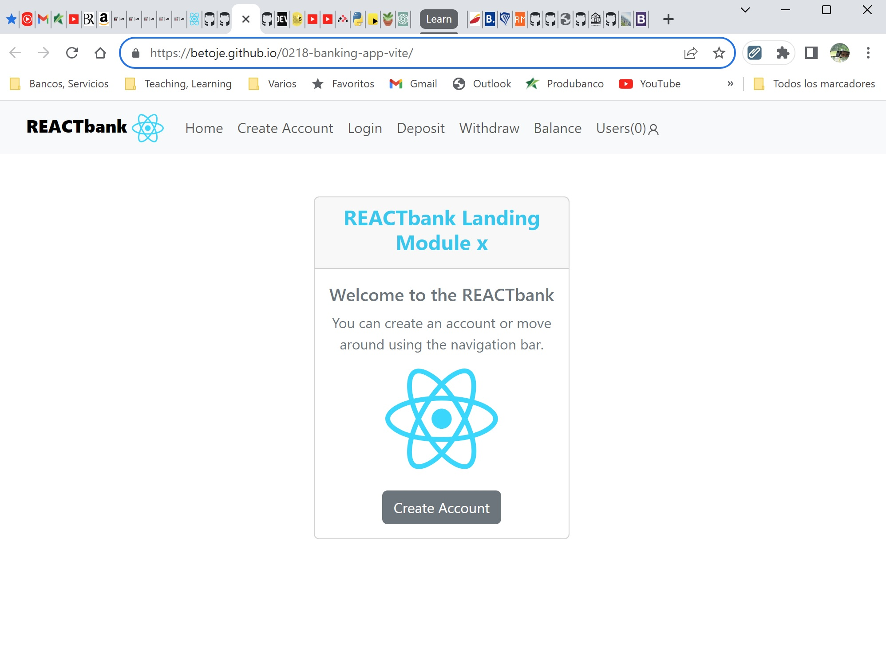

# 0218-banking-app-vite (React + Vite) - Alberto Jácome


> :smile:**Banking Application**
>
> *Hecha con React.js:*

>> Repositorio:

>>> 0218-banking-app-vite https://github.com/betoje/0218-banking-app-vite
  
---



---

<div align="center" id="top"> 
  
  &#xa0;
</div>

<p align="center">
  
  
  
  
  
  
</p>

<p align="center">
  <a href="#dart-acerca">Acerca</a> &#xa0; | &#xa0; 
  <a href="#sparkles-caracteristicas">Caracteristicas</a> &#xa0; | &#xa0;
  <a href="#rocket-tecnologias>Tecnologias</a> &#xa0; | &#xa0;
  <a href="#white_check_mark-requerimientos">Requerimientos</a> &#xa0; | &#xa0;
  <a href="#checkered_flag-instrucciones">Instrucciones</a> &#xa0; | &#xa0;
  <a href="#memo-licencia">Licencia</a> &#xa0; | &#xa0;
  <a href="https://github.com/betoje" target="_blank">Autor</a>
</p>

---


## :dart: Acerca ##

Banking Application (Front-End implementation)

## :sparkles: Caracteristicas ##

Banking Application hecha con: 

   :ballot_box_with_check: React.js
   :ballot_box_with_check: Vite (bundler)

## :rocket: Tecnologias ##

Los siguientes lenguajes/herramientas fueron usados en este proyecto:

- JavaScript, HTML, CSS
- React.js
- Vite 
- Bootstrap
- React Bootstrap
- React Router
- React Icons
- React Context y Context API
- Github Pages Deployment

## :white_check_mark: Requerimientos ##

Antes de empezar :checkered_flag:, se necesita tener [Git](https://git-scm.com) instalado.

## :checkered_flag: Instrucciones ##

```bash
# Clone este proyecto
$ git clone git@github.com:betoje/0218-banking-app-vite.git

# Acceda al directorio
$ cd 0218-banking-app-vite

# Acceda a la terminal

# Instale las dependencias
$ npm install

# Ejecute la aplicación en su ambiente local
$ npm run dev

# Puede también directamente ejecutar la aplicación que se encuentra desplegada en Github Pages directamente en su navegador:
https://betoje.github.io/0218-banking-app-vite/
```
## :memo: Licencia ##

Este proyecto está bajo la licencia de MIT. Para mayores detalles vea el archivo [LICENSE](LICENSE).

---

<!--
[](http://commonmark.org)
-->

  por <a href="https://github.com/betoje" target="_blank">Alberto Jacome</a>
 :heart: &#xa0;

<a href="#top">Regresar al inicio</a>